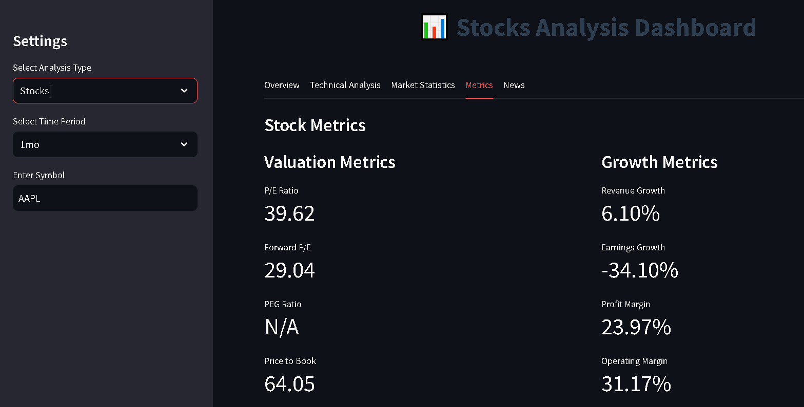
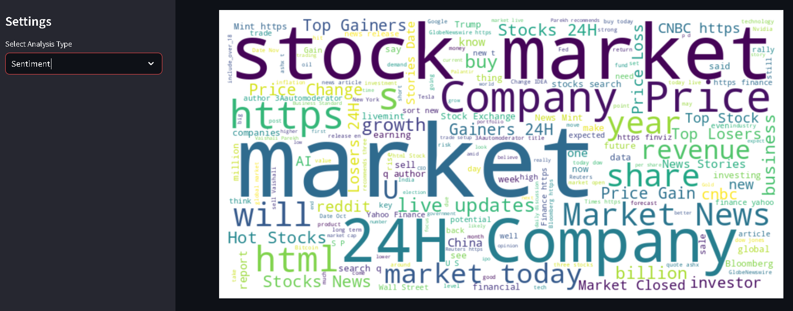
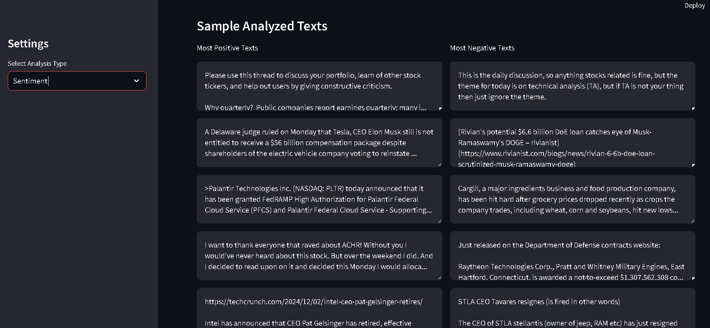

# Sentimental Trading Dashboard

An advanced interactive web application that blends **sentiment analysis** with **financial trading insights**. This project enables users to visualize stock trends, analyze market sentiment, and gain data-driven insights for informed trading decisions. Powered by Python, Streamlit, and external APIs, the dashboard is designed for seamless, real-time user interaction.

---

## Live Demo

Try out the live version of the dashboard here:  
👉 [Sentimental Trading Dashboard](https://sentimental-trading.streamlit.app)

---

## GitHub Repository

Access the source code and contribute to the project:  
👉 [Sentimental Trading Repository](https://github.com/AdrshChaudhary/Sentimental-trading)

---

## Features

- **Real-time Data Fetching**: Fetches live stock prices and sentiment data.
- **Sentiment Analysis**: Visualizes the impact of news sentiment on stock prices.
- **Interactive Charts**: Customizable stock price and sentiment trend visualizations.
- **Enhanced User Experience**: Intuitive layout with dynamic data visualizations.

---

## Screenshots

### Dashboard Overview  


### Stock Metrics  


### Best sentiments map


### Sample sentiments


---

## Tech Stack

- **Frontend**: Streamlit for interactive UI
- **Backend**: Python for data processing and API integration
- **APIs Used**:
  - News Sentiment API for news-based sentiment data from telegram and reddit.
- **Libraries**:
  - `pandas`, `numpy` for data manipulation
  - `matplotlib`, `plotly` for visualizations
  - `requests` for API interactions

---

## Installation and Setup

Follow these steps to set up the project locally:

1. **Clone the Repository**
   ```bash
   git clone https://github.com/AdrshChaudhary/Sentimental-trading.git
   cd Sentimental-trading

2. **Create and Activate a Virtual Environment**
   ```bash
   python -m venv env
   source env/bin/activate   # On Windows, use env\Scripts\activate

3. **Install Dependencies**
   ```bash
   pip install -r requirements.txt

3. **Add API Keys**
   1. Create a .env file in the project root.
   2. Add your API keys as follows:
   ```bash
   TWITTER_API_KEY=api_key
   TWITTER_API_SECRET_KEY=secret_key
   REDDIT_CLIENT_ID=client_id
   REDDIT_SECRET=secret
   REDDIT_USERNAME=username
   REDDIT_PASSWORD=password
   REDDIT_USER_AGENT=app_name (by u/your_reddit_username)
   TELEGRAM_API_ID=api
   TELEGRAM_API_HASH=hash

4. **Install Dependencies**
   ```bash
   streamlit run dashboard.py
**The app will open in your default web browser.**

## Usage
- Select the stock ticker symbol of interest from the dropdown menu.
- View live stock prices, sentiment analysis, and market trends.
- Use interactive charts to explore data visually.
- Analyze the impact of sentiment on trading decisions.

## License
**This project is licensed under the MIT License. See the full text below:**
### MIT License

Copyright (c) **2024 Aadarsh Chaudhary**

Permission is hereby granted, free of charge, to any person obtaining a copy of this software and associated documentation files (the "Software"), to deal in the Software without restriction, including without limitation the rights to use, copy, modify, merge, publish, distribute, sublicense, and/or sell copies of the Software, and to permit persons to whom the Software is furnished to do so, subject to the following conditions:

1. The above copyright notice and this permission notice shall be included in all copies or substantial portions of the Software.

2. THE SOFTWARE IS PROVIDED "AS IS", WITHOUT WARRANTY OF ANY KIND, EXPRESS OR IMPLIED, INCLUDING BUT NOT LIMITED TO THE WARRANTIES OF MERCHANTABILITY, FITNESS FOR A PARTICULAR PURPOSE AND         NONINFRINGEMENT. IN NO EVENT SHALL THE AUTHORS OR COPYRIGHT HOLDERS BE LIABLE FOR ANY CLAIM, DAMAGES OR OTHER LIABILITY, WHETHER IN AN ACTION OF CONTRACT, TORT OR OTHERWISE, ARISING FROM,     OUT OF OR IN CONNECTION WITH THE SOFTWARE OR THE USE OR OTHER DEALINGS IN THE SOFTWARE.


## Contributing
Contributions are welcome!
If you'd like to contribute, please fork the repository and create a pull request.

## Author
**Aadarsh Chaudhary**
- [Portfolio](https://aadrsh.netlify.app/)
- [LinkedIN](https://www.linkedin.com/in/aadarshchaudhary/)
- [Github](https://github.com/AdrshChaudhary)


